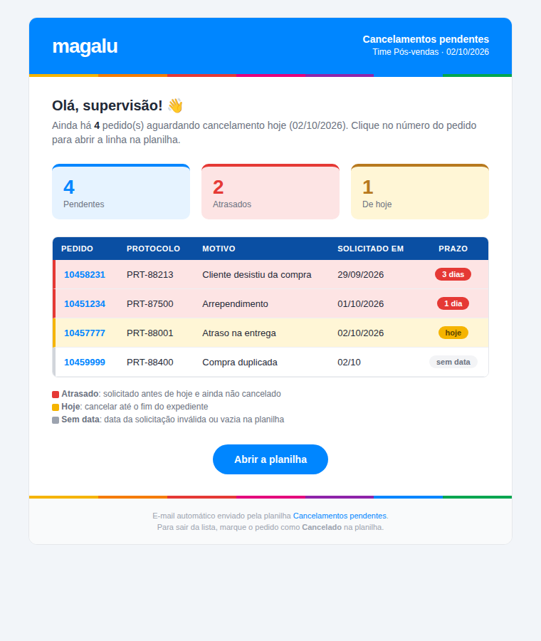

# 📬 Lembrete diário de cancelamentos pendentes (Google Sheets + Apps Script)

Automação criada para um time de pós-vendas que registra pedidos de cancelamento em uma planilha do Google Sheets. Todo dia útil, às **17:30**, um e-mail é enviado automaticamente aos supervisores com a lista de pedidos que **ainda não foram cancelados**, evitando que alguma solicitação passe despercebida.

Roda 100% nos servidores do Google: não precisa de computador ligado, servidor nem clique manual.



*Prévia gerada com dados fictícios.*

## Problema

As solicitações de cancelamento eram enviadas em um grupo de chat, e algumas acabavam se perdendo no meio das mensagens. Faltava uma visão diária e consolidada do que ainda estava pendente.

## Como funciona

1. Os agentes registram cada solicitação na planilha (pedido, protocolo, motivo e data).
2. O supervisor marca o status como **Cancelado** ao concluir.
3. Todo dia útil, o script lê a planilha (somente leitura) e envia um e-mail com os pendentes:
   - ordenados da solicitação **mais antiga para a mais recente**;
   - 🔴 **vermelho**: solicitados antes de hoje e ainda não cancelados (atrasados);
   - 🟡 **amarelo**: solicitados hoje, ainda dentro do prazo;
   - cada número de pedido é um link que abre a planilha direto na linha correspondente.

### Visual do e-mail

O e-mail segue a identidade visual do Magalu: cabeçalho azul com logo, faixa colorida, cartões com o total de pendentes, atrasados e de hoje, selos de prazo em cada linha e botão para abrir a planilha. Quando não há pendências, o e-mail mostra "Tudo em dia!". As cores e o logo ficam no objeto `CONFIG` (`LOGO_URL` vazio usa o nome "magalu" em texto).

### Agendamento preciso às 17:30

Gatilhos diários do Apps Script disparam em uma janela de 1 hora, sem minuto exato. Para garantir o horário, o projeto usa dois passos:

```
Gatilho diário (16h–17h) ──► agendarEnvioDoDia()
                                   │
                                   └─► cria gatilho único para hoje às 17:30 ──► enviarLembrete()
```

## Estrutura esperada da planilha

| A | B | C | D | E |
|---|---|---|---|---|
| Número do pedido | Protocolo | Motivo do cancelamento | Data da solicitação | Status (`Cancelado` / `Nao Cancelado`) |

Linha 1 é o cabeçalho, e os dados começam na linha 3 (ajustável em `CONFIG.LINHA_INICIAL`). Qualquer status diferente de "Cancelado" (sem diferenciar maiúsculas ou acentos) conta como pendente.

## Instalação

1. Na planilha: **Extensões → Apps Script**. Cole o conteúdo de [`src/Codigo.gs`](src/Codigo.gs) e salve.
2. **Configurações do projeto** (engrenagem):
   - Fuso horário: `(GMT-03:00) São Paulo`;
   - **Propriedades do script → Adicionar**:

     | Propriedade | Obrigatória | Exemplo |
     |---|---|---|
     | `EMAILS_DESTINO` | sim | `email1@empresa.com, email2@empresa.com` |
     | `NOME_TIME` | não | `Time Pós-vendas` (aparece no cabeçalho) |
     | `ROTULO_PROTOCOLO` | não | título da coluna de protocolo (padrão: `Protocolo`) |
3. Ajuste o objeto `CONFIG` se necessário (nome da aba, linha inicial, horário).
4. Execute **`testarEmail`**. Ele envia uma prévia somente para você.
5. Execute **`criarGatilhos`** uma única vez (ou crie em *Acionadores*: função `agendarEnvioDoDia`, baseado no tempo, contador de dias, 16h–17h).

> ⚠️ Não execute `enviarLembrete` manualmente: ele envia para os destinatários reais.

## Tecnologias

- Google Apps Script (JavaScript V8)
- Google Sheets (`SpreadsheetApp`)
- Gmail (`MailApp`), com e-mail HTML
- Gatilhos baseados em tempo (`ScriptApp`)

## Privacidade

Nenhum e-mail, nome de time, ID de planilha ou dado de pedido fica no código. Essas informações ficam nas **Propriedades do script**, que não são versionadas. A prévia acima usa dados fictícios.
